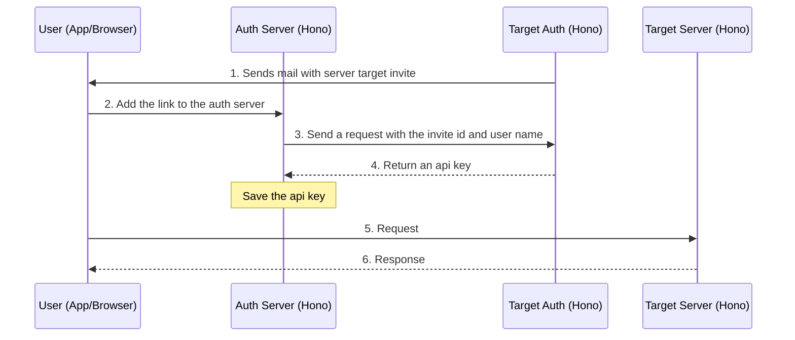

# Ancore Federated Auth: Manual Discovery Architecture

## 1. Sequence Diagram

## 2. Steps Review this in the future

- [ ] Simple login set-up better auth
  - [ ] Login to the auth server
  - [ ] He auth server provides privileges to access the chat/voice server
- [ ] The Manual Discovery
