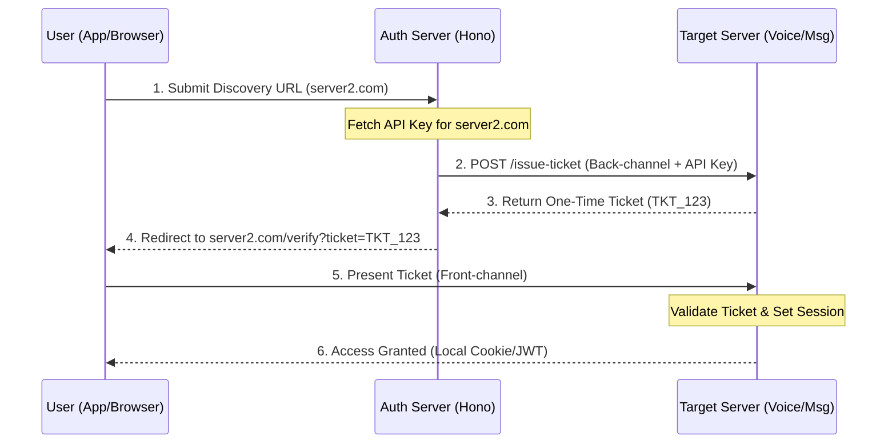

# Ancore Federated Auth: Manual Discovery Architecture

This document defines the "Mattermost-style" manual discovery flow used to bridge authentication between the **Central Auth Server** and independent **Target Servers**.

## 1. High-Level Flow

1.  **Discovery:** The user enters a Target Server URL (e.g., `https://server2.com`) into the Ancore App.
2.  **Verification:** The Auth Server (Hono) verifies the domain and retrieves the stored `MASTER_API_KEY` for that specific domain.
3.  **The Handshake (Back-channel):** The Auth Server calls the Target Server's API internally using the secret key to request a **One-Time Ticket (OTT)** for the user.
4.  **The Handoff (Front-channel):** The user is redirected to the Target Server with the OTT appended to the URL.
5.  **Validation:** The Target Server validates the OTT (which it issued itself moments prior) and grants the user a local session.

## 2. Sequence Diagram



## 3. Implementation Details

### Back-channel Handshake (Hono API)
The Auth Server uses the user-provided URL to look up credentials and request the bridge ticket.

```typescript
// apps/api/src/routes/connect.ts
app.post('/connect', async (c) => {
  const { targetUrl } = await c.req.json();
  const user = c.get('user');

  // Retrieve the secret key for the target domain
  const server = await db.serverRegistry.findUnique({ where: { url: targetUrl } });

  // Request the ticket from the Target Server
  const response = await fetch(`${targetUrl}/api/v1/tickets`, {
    method: 'POST',
    headers: { 'Authorization': `Bearer ${server.apiKey}` },
    body: JSON.stringify({ userId: user.id })
  });

  const { ticket } = await response.json();
  return c.json({ redirectUrl: `${targetUrl}/verify?ticket=${ticket}` });
});
```

### Front-channel Verification (Target Server)
The Target Server consumes the ticket to finalize the login.

```typescript
// Target Server Logic
app.get('/verify', async (c) => {
  const ticket = c.req.query('ticket');
  
  // Verify ticket exists in local memory/cache
  const isValid = await cache.consume(ticket);
  
  if (isValid) {
    // Set local session for the user on this domain
    return setLocalSession(c);
  }
});
```

## 4. Key Advantages
- **Domain Agnostic:** The Auth Server can connect to any Target Server as long as the user provides the URL.
- **Security:** Secret API keys never leave the Auth Server.
- **User Privacy:** Target Servers only receive the specific user data required for that session.
- **Cross-Platform:** Works natively in Web, Desktop (Electron), and Mobile (React Native).